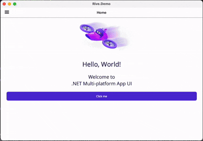

<h1 align="center">BindingPocket</h1>

<small>MAUI bindings for [X]Project on iOS, Android, and macOS</small>

This repository is a collection of .NET MAUI binding libraries. RiveRuntime.Maui is the first binding project; additional bindings (2, 3, …) will be added over time.

## 1. RiveRuntime.Maui

MAUI bindings for RiveRuntime on iOS, Android, and macOS

Bindings around the native Rive runtimes to support iOS, Android, and macOS in .NET MAUI.
- rive-android-10.5.3.aar
- RiveRuntime.framework (based on 6.12.3, with additional changes to expose a public state machine state delegate; see my fork: [upgrade rive-ios](https://github.com/BigLazyET/rive-ios))

 
 
 
 
 
 

### Getting started
- Install the NuGet package: [RiveRuntime.Maui](https://www.nuget.org/packages/RiveRuntime.Maui/)
- In MauiProgram.cs, call `UseRiveRuntime()` on the `MauiAppBuilder`, You can change the rendertype via RenderOptions
- Minimum iOS target: 14.0; macOS target: 15.0
- Add your `.riv` assets to `Resources/Images`
- See the [demo](./RiveRuntime/demo/Rive.Demo) for more details
- If you just need Rive on sinlgele platform, consider using [RiveRuntime.iOS](https://www.nuget.org/packages/RiveRuntime.iOS/) or [RiveRuntime.Android](https://www.nuget.org/packages/RiveRuntime.Android/) instead.
- If you need help, please open an issue.

## 2. One or more additional bindings
More bindings are coming soon.

## Thanks
- Thanks to matmork for his [rive-maui](https://github.com/matmork/rive-maui), which inspired this binding library.